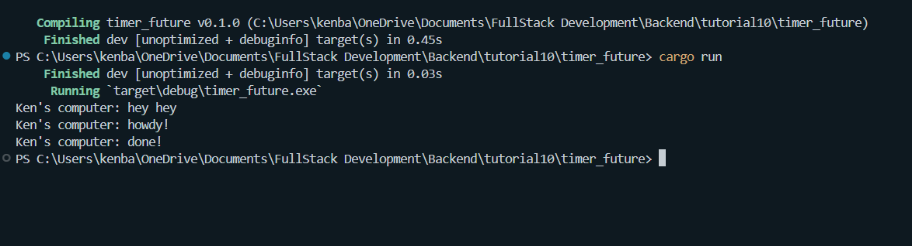

# timer_future
1. 
Noticed that "Ken's computer: hey hey" was printed first before the other 2 print commands despite being ordered last on the procedural code. 
The output "Ken's computer: hey hey" is printed first because it is executed synchronously and immediately when the main function runs, before any asynchronous operations begin. The lines "Ken's computer: howdy!" and "Ken's computer: done!" are part of an asynchronous task that waits for a timer to complete, which is why they appear after the initial synchronous output.