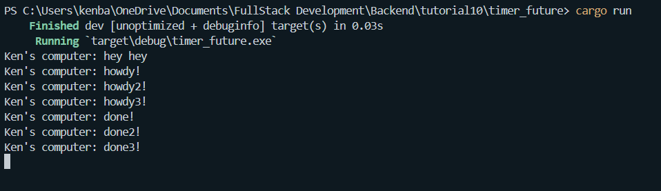
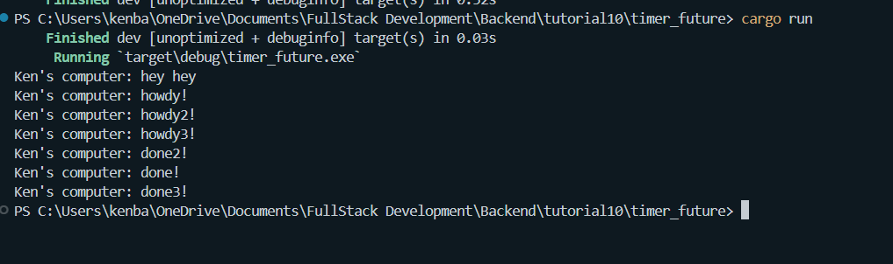

# timer_future
1. 
Noticed that "Ken's computer: hey hey" was printed first before the other 2 print commands despite being ordered last on the procedural code. 
The output "Ken's computer: hey hey" is printed first because it is executed synchronously and immediately when the main function runs, before any asynchronous operations begin. The lines "Ken's computer: howdy!" and "Ken's computer: done!" are part of an asynchronous task that waits for a timer to complete, which is why they appear after the initial synchronous output.
2. 
- (without drop(spawner);)
- (With drop(spawner);)

The output above is due to all tasks being spawned and executing their initial print statements (howdy, howdy2, howdy3) synchronously before they asynchronously await a timer. Once the timer in each task completes, they print their respective done messages. The program continues running indefinitely because the spawner is not dropped, keeping the channel open and causing the executor to wait endlessly for more tasks.